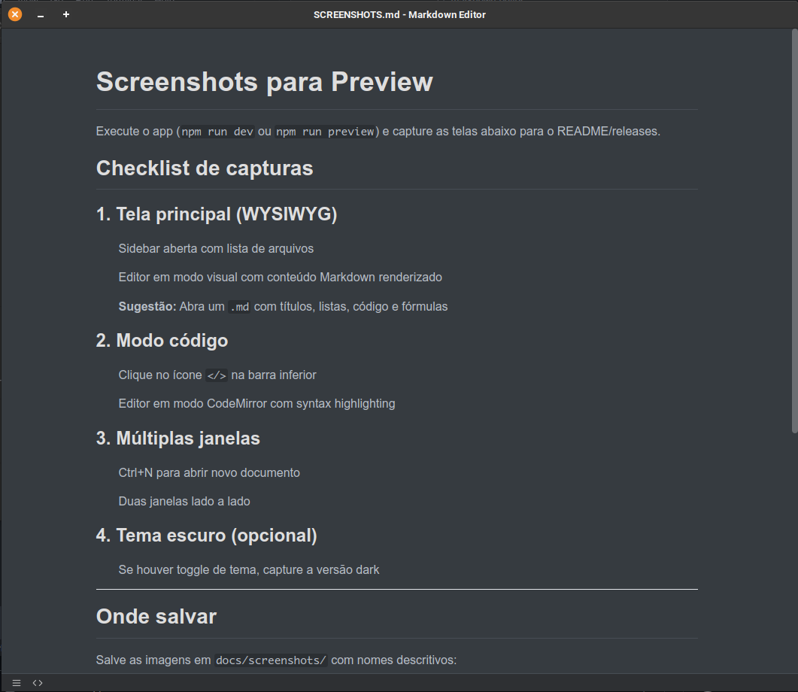
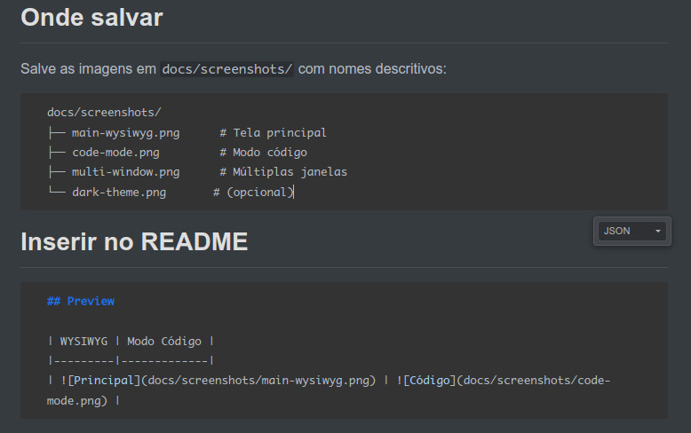
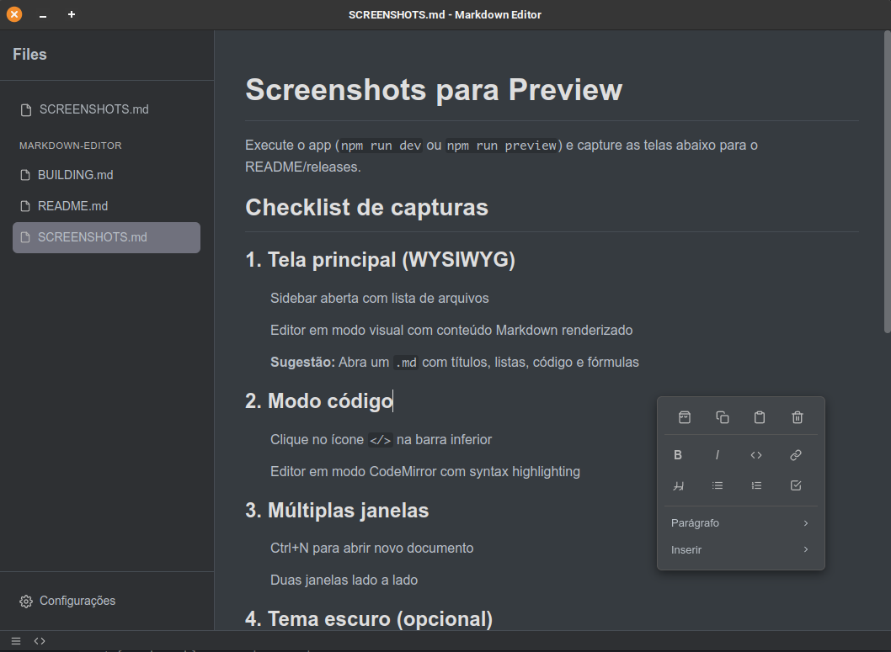

# Markdown Editor

Editor Markdown inspirado no Typora, construído com Electron e Vue.

[English](README.en.md) · [Español](README.es.md) · [日本語](README.jp.md)

## Preview

| Editor WYSIWYG | Modo Código |
|----------------|-------------|
|  |  |

| Sidebar | Sidebar + Menu |
|---------|----------------|
|  |  |

## ✨ Recursos

- **Preview em tempo real** - Markdown renderizado enquanto digita
- **Modo WYSIWYG e Código** - Alternância entre edição visual e CodeMirror
- **Operações de arquivo** - Criar, abrir, salvar (Ctrl+S, Ctrl+O)
- **Novo documento em nova janela** - Ctrl+N abre nova janela
- **Syntax highlighting** - CodeMirror com suporte a Markdown
- **Fórmulas LaTeX** - Expressões matemáticas com KaTeX
- **GitHub Flavored Markdown** - Suporte a GFM

## 🚀 Tech Stack

- **Electron** - Framework desktop
- **Vue 3** - UI com Composition API
- **Vite** - Build tool
- **Tailwind CSS** - Estilos
- **TipTap** - Editor WYSIWYG
- **CodeMirror 6** - Modo código
- **Pinia** - State management

## 🛠️ Começando

### Pré-requisitos

- Node.js v18+
- npm

### Instalação

```bash
npm install
npm run dev
```

### Build

```bash
npm run build          # Build para produção
npm run build:linux    # AppImage + .deb
npm run build:win      # NSIS + Portable
npm run build:mac      # DMG + ZIP
```

## ⌨️ Atalhos

| Atalho | Ação |
|--------|------|
| Ctrl+N | Novo documento (nova janela) |
| Ctrl+O | Abrir arquivo |
| Ctrl+S | Salvar |
| Ctrl+Shift+S | Salvar como |

## 📚 Documentação

- [MVP](docs/MVP.md)
- [Roadmap](docs/README.md)
- [Screenshots](SCREENSHOTS.md)

## 📄 Licença

MIT
